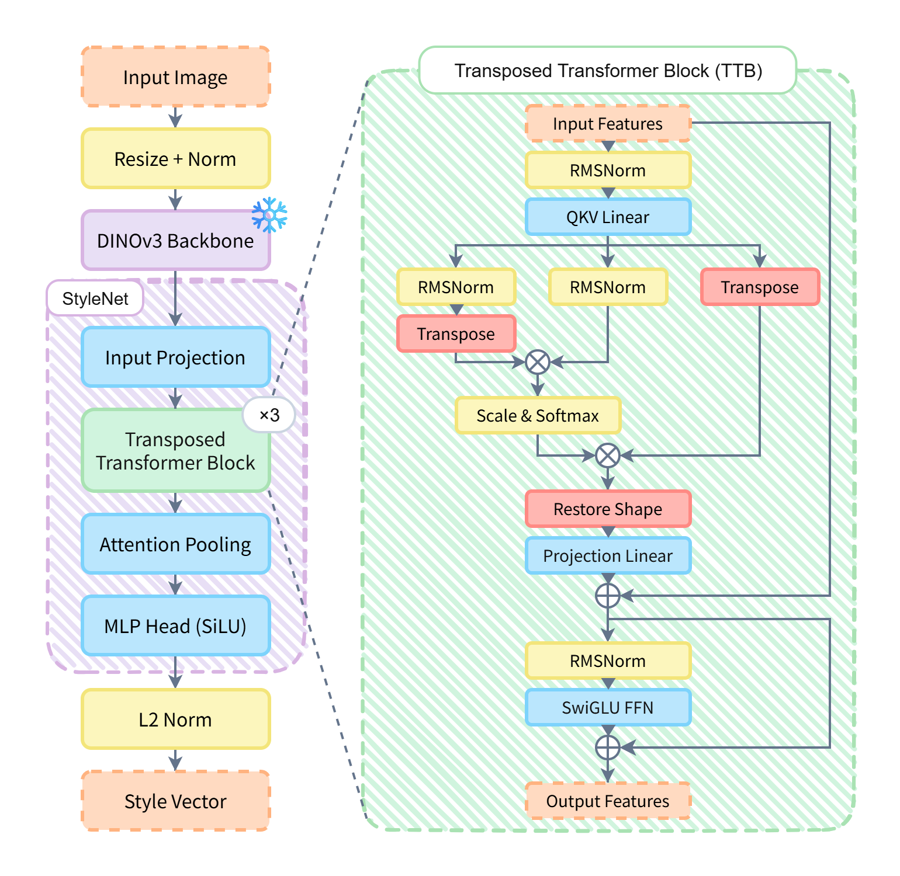
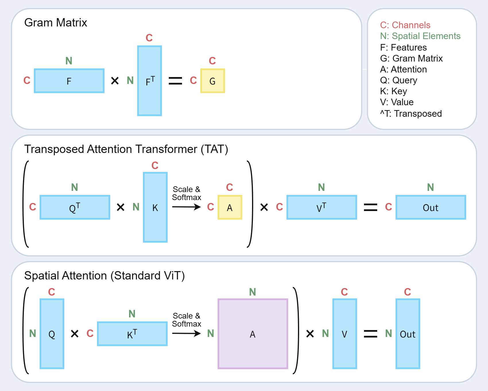

<div align="center">

[English](README.md) | [日本語](README.ja.md)

# EgaraNet

**イラストの絵柄（画風）のEmbeddingモデル**

イラストの画風を高次元ベクトルへとエンコードするEgaraNetのトレーニング・推論コードです。

[](https://huggingface.co/Columba1198/EgaraNet)
[](https://egara-net.vercel.app/)
[](LICENSE)

</div>

---

## 概要

**EgaraNet** は、イラストの「画風（絵柄）」を1024次元のEmbeddingベクトルへとエンコードする深層学習モデルです。約1万2千人のアーティストによる約120万枚のイラストを学習しており、同じアーティストのイラストがベクトル空間内で近くに配置されるようにEmbeddingを生成します。

これにより、以下のような応用が可能です。
- 🎨 **画風の類似度判定** — 2枚のイラストの絵柄がどれほど似ているかを比較
- 🔍 **絵柄ベースの検索** — 似た絵柄のイラストを検索
- 📊 **画風クラスタリング** — 視覚的な「絵柄」に基づいてイラストをグループ化

このリポジトリは EgaraNet の**トレーニング・推論コード**を提供します。学習済みモデルは [🤗 Columba1198/EgaraNet](https://huggingface.co/Columba1198/EgaraNet) を参照してください。

> 著作権法第30条の4（情報解析等）に基づいて作成されています。

## アーキテクチャ

<p align="center">
  
</p>

EgaraNetは、2つの主要なコンポーネントで構成された複合モデルです。

| コンポーネント | 説明 |
|-----------|-------------|
| **Backbone** | DINOv3 ViT-L/16 — DINOv3アルゴリズムによる自己教師あり学習で事前学習されたVision Transformer |
| **Head** | StyleNet — Transposed Attention Transformer (TAT) を用いたカスタムデコーダ |

### Transposed Attention Transformer (TAT)

**Transposed Attention Transformer**（注意転置型トランスフォーマー）は、空間的な情報ではなく、チャネル領域で特徴を処理することで画風情報を抽出するために設計されたTransformerです。「特徴マップのGram行列がコンテンツとは独立した画風（スタイル）を表現する」というGatysらの発見（[CVPR 2016](https://openaccess.thecvf.com/content_cvpr_2016/html/Gatys_Image_Style_Transfer_CVPR_2016_paper.html)）から着想を得ており、以下の手順でクロス共分散（Cross-covariance）Attentionを計算します。

1. Queryを転置: `Q.T` → `(N, HeadDim)` ではなく `(HeadDim, N)` の形状にする
2. Attentionを計算: `(Q.T @ K)` → `(HeadDim, HeadDim)` の形状、つまり C×C のチャネル相関行列を作成
3. これにより、標準的な `(N, N)` の空間Attentionを、チャネル対チャネルのAttentionマップへと置き換えます。

この処理によって位置情報を意図的に捨て、各特徴（チャネル）が互いにどのように相関しているか（＝絵柄のシグネチャ）のみを保持します。

<p align="center">
  
</p>

チャンネルの注意機構は新しいものではなく、以下のような先行研究が存在します。
- [Restormer: Efficient Transformer for High-Resolution Image Restoration](https://arxiv.org/abs/2111.09881)
- [Multi-Head Transposed Attention Transformer for Sea Ice Segmentation in Sar Imagery](https://ieeexplore.ieee.org/document/10640437)
- [MANIQA: Multi-dimension Attention Network for No-Reference Image Quality Assessment](https://arxiv.org/abs/2204.08958)

### 技術仕様

| パラメータ | 値 |
|-----------|-------|
| Embedding次元数 | 1024 |
| Backbone | DINOv3 ViT-L/16 (hidden_size=1024) |
| TAT層数 | 3 |
| Attentionヘッド数 | 16 (head_dim=64) |
| 入力解像度 | 動的アスペクト比対応 (16の倍数) |
| 学習データ | 約12,000人 / 約120万枚のイラスト |

## インストール

```bash
git clone https://github.com/Columba1198/EgaraNet.git
cd EgaraNet
pip install -r requirements.txt
```

### 動作要件

- Python 3.10以上
- PyTorch 2.0以上
- CUDA GPU推奨（CPUでも動作しますが低速です）

## データセットの準備

アーティストごとにサブディレクトリを作成してください。

```
dataset/
├── artist_A/
│   ├── image_001.png
│   ├── image_002.jpg
│   └── ...
├── artist_B/
│   ├── image_010.png
│   └── ...
└── ...
```

- 各サブディレクトリが1人のアーティストに対応します。
- 最低2つ以上のアーティストディレクトリが必要です。
- 1アーティストにつき最低2枚以上の画像が必要です。
- 対応画像フォーマットはPNG, JPEG, WebP, BMPです。

## トレーニング

### クイックスタート

```bash
python train.py --data_dir ./dataset
```

### 設定ファイルを使用

```bash
python train.py --data_dir ./dataset --config configs/default.yaml
```

### CLI引数でオーバーライド

```bash
python train.py --data_dir ./dataset \
    --epochs 20 \
    --lr 1e-5 \
    --accum_steps 64 \
    --margin 0.3 \
    --bf16 true
```

### トレーニングの再開

```bash
python train.py --data_dir ./dataset --resume checkpoints/epoch_5.pth
```

### トレーニングの流れ

トレーニングは2つのフェーズで進行します。

1. **特徴量キャッシュ**: DINOv3バックボーンの特徴量を一度だけ抽出し、画像ごとに `.pt` ファイルとして保存します。これにより、毎エポックでバックボーンの特徴量を再計算する必要がなくなります。

2. **StyleNetトレーニング**: キャッシュされた特徴量を使い、Triplet Margin Lossで StyleNet ヘッドを学習します。

> **注意**: `keep_aspect_ratio=true`（デフォルト）の場合、画像サイズが可変のためバッチサイズは1に強制されます。勾配累積 (Gradient Accumulation) を使用して実効バッチサイズを大きくします。

## 推論

### CLIでの使用方法

```bash
# 単一画像 — ベクトルを標準出力に表示
python inference.py --model checkpoints/epoch_10.pth --input image.png

# ディレクトリ内の画像 — CSV出力
python inference.py --model checkpoints/epoch_10.pth --input ./images/ --output vectors.csv

# 2枚の画像を比較
python inference.py --model checkpoints/epoch_10.pth --compare a.png b.png

# HuggingFace Hubの学習済みモデルを使用
python inference.py --hf Columba1198/EgaraNet --input image.png
```

### Python APIでの使用方法

```python
from egaranet import EgaraNet, cosine_similarity

# チェックポイントから読み込み
model = EgaraNet.from_checkpoint("checkpoints/epoch_10.pth")

# またはHuggingFace Hubから読み込み
model = EgaraNet.from_huggingface("Columba1198/EgaraNet")

# スタイルベクトルを抽出
vec_a = model.extract_style_vector("image_a.png")  # numpy [1024]
vec_b = model.extract_style_vector("image_b.png")

# 画風を比較（ベクトルはL2正規化済み、内積＝コサイン類似度）
sim = cosine_similarity(vec_a, vec_b)
print(f"絵柄の類似度: {sim:.4f} ({sim * 100:.1f}%)")
```

### バッチ抽出

```python
from egaranet import EgaraNet

model = EgaraNet.from_checkpoint("checkpoints/epoch_10.pth")
vectors = model.extract_style_vectors(["img1.png", "img2.png", "img3.png"])
print(vectors.shape)  # (3, 1024)
```

## 設定

デフォルト設定は `configs/default.yaml` にあります。すべての設定はCLI引数でオーバーライドできます。

| セクション | キー | デフォルト | 説明 |
|---------|-----|---------|-------------|
| model | backbone | `facebook/dinov3-vitl16-pretrain-lvd1689m` | DINOv3バックボーンのモデルID |
| model | tat_layers | 3 | TATレイヤー数 |
| model | tat_heads | 16 | TATのAttentionヘッド数 |
| model | hidden_dim | 1024 | TATの内部次元数 |
| model | output_dim | 1024 | スタイルベクトルの次元数 |
| preprocessing | max_size | 512 | 画像の最大サイズ（長辺） |
| preprocessing | keep_aspect_ratio | true | アスペクト比を保持 |
| preprocessing | mean | `[0.485, 0.456, 0.406]` | 画像正規化の平均値 |
| preprocessing | std | `[0.229, 0.224, 0.225]` | 画像正規化の標準偏差 |
| training | epochs | 10 | トレーニングエポック数 |
| training | batch_size | 1 | 1ワーカーあたりのバッチサイズ |
| training | accumulation_steps | 128 | 勾配累積ステップ数 |
| training | learning_rate | 5.0e-6 | AdamWの学習率 |
| training | weight_decay | 1.0e-4 | AdamWのWeight Decay |
| training | triplet_margin | 0.2 | Triplet Lossのマージン |
| training | bf16 | true | BF16混合精度学習 |
| training | checkpoint_dir | `"./checkpoints"` | チェックポイントの保存ディレクトリ |
| training | num_workers | 4 | DataLoaderのワーカー数 |
| inference | bf16 | true | BF16混合精度推論 |

## プロジェクト構成

```
.
├── egaranet/                  # Pythonパッケージ
│   ├── __init__.py            # パッケージのエクスポート
│   ├── model.py               # EgaraNetモデル（Backbone + StyleNet）
│   ├── layers.py              # カスタムレイヤー（RMSNorm, SwiGLU, TAT, AttentionPooling）
│   ├── losses.py              # 損失関数（TripletLoss）
│   ├── preprocessing.py       # 画像前処理（MaxResizeMod16）
│   └── dataset.py             # データセットローダー（StyleTripletDataset）
├── configs/
│   └── default.yaml           # デフォルト設定ファイル
├── train.py                   # トレーニングCLI
├── inference.py               # 推論CLI
├── requirements.txt           # Python依存パッケージ
├── LICENSE                    # ライセンス（Apache 2.0）
├── README.md                  # 英語ドキュメント
└── README.ja.md               # 日本語ドキュメント
```

## 入力要件

- **画像フォーマット**: RGB画像 (PNG, JPEG, WebP, BMP)
- **解像度**: 動的 — 高さ・幅が16の倍数であれば、あらゆる解像度の画像を受け付けます。デフォルトの前処理 `MaxResizeMod16(512)` は、アスペクト比を維持したまま長辺を512pxにリサイズし、縦横それぞれの次元を16の倍数へとスナップします。
- **正規化**: ImageNet統計情報を使用 (mean=[0.485, 0.456, 0.406], std=[0.229, 0.224, 0.225])

## 参考文献

- **DINOv3**: "DINOv3" [arXiv:2508.10104](https://arxiv.org/abs/2508.10104)
- **Style Transfer**: "Image Style Transfer Using Convolutional Neural Networks" [CVPR 2016](https://openaccess.thecvf.com/content_cvpr_2016/html/Gatys_Image_Style_Transfer_CVPR_2016_paper.html)
- **Restormer**: "Restormer: Efficient Transformer for High-Resolution Image Restoration" [arXiv:2111.09881](https://arxiv.org/abs/2111.09881)
- **MHTA**: "Multi-Head Transposed Attention Transformer for Sea Ice Segmentation in Sar Imagery" [IGARSS 2024](https://ieeexplore.ieee.org/document/10640437)
- **MANIQA**: "MANIQA: Multi-dimension Attention Network for No-Reference Image Quality Assessment" [arXiv:2204.08958](https://arxiv.org/abs/2204.08958)

## リンク

- 🌐 **デモサイト**: [egara-net.vercel.app](https://egara-net.vercel.app/)
- 🤗 **学習済みモデル**: [huggingface.co/Columba1198/EgaraNet](https://huggingface.co/Columba1198/EgaraNet)
- 📖 **GitHub**: [github.com/Columba1198/EgaraNet](https://github.com/Columba1198/EgaraNet)

## ライセンス

このプロジェクトは Apache License 2.0 のもとで公開されています。詳細は [LICENSE](LICENSE) ファイルを参照してください。
